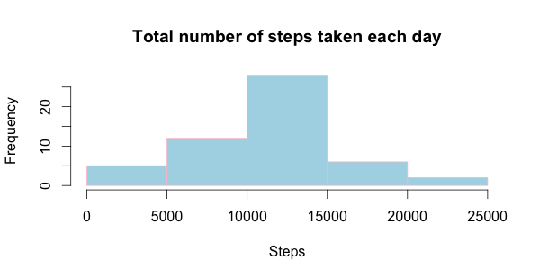
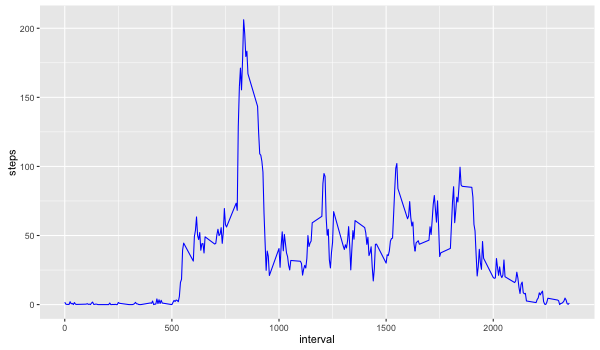
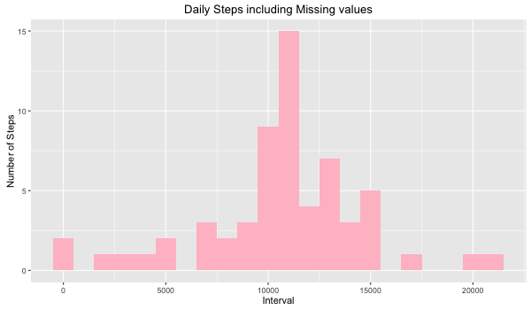
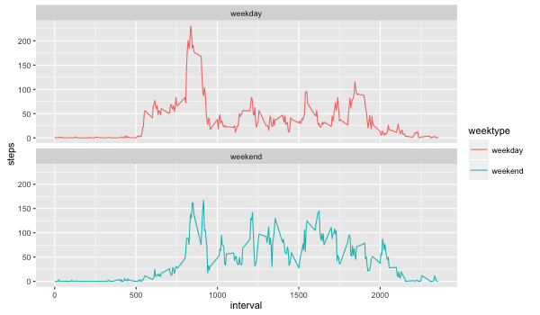

##Reproducible Research Course Project 1  

###Jie Zhang
###July 27, 2016

This file is for the Reproducible Research Course Project 1.

###Loading and processing the data
Load the data(i.e. read.csv())
```{r,echo = TRUE}
setwd("/Users/Maggie/Desktop/Reproducible Research")
library(knitr)
opts_chunk$set(echo = TRUE)
activity <- read.csv("activity.csv", header = TRUE, sep = ",")
```

Process/transform the data(if necessary) into a format suitable for your analysis
```{r}
library(lubridate)
activity$date <- ymd(activity$date)
```

What is mean total number of steps taken per day?
```{r}
meanperday <- aggregate(steps ~ date, activity, mean)
head(meanperday)
##   date    steps
##1 2012-10-02  0.43750
##2 2012-10-03 39.41667
##3 2012-10-04 42.06944
##4 2012-10-05 46.15972
##5 2012-10-06 53.54167
##6 2012-10-07 38.24653
```

Make a histogram of the total number of steps taken each day
```{r}
stepsperday <- aggregate(steps ~ date, activity, sum)
hist(stepsperday$steps, main = "Total number of steps taken each day",
                 col = "lightblue", border = "pink", xlab = "Steps" )
```


Calculate and report the mean and median total number of steps taken per day.
```{r}
mean <- mean(stepsperday$steps)
mean
## [1] 10766.19
median <- median(stepsperday$steps)
median
## [1] 10765
```

###What is the average daily activity pattern?

Make a time series plot(i.e. type = “1”) of the 5-minute interval(x-axis) and the average number of steps taken, averaged across all days(y-axis)
```{r}
library(dplyr)
## 
## Attaching package: 'dplyr'
## The following objects are masked from 'package:lubridate':
## 
##     intersect, setdiff, union
## The following objects are masked from 'package:stats':
## 
##     filter, lag
## The following objects are masked from 'package:base':
## 
##     intersect, setdiff, setequal, union
interval <- activity %>%
            filter(!is.na(steps)) %>%
            group_by(interval) %>%
           summarize(steps = mean(steps))

library(ggplot2)
ggplot(interval, aes(x=interval, y=steps)) +geom_line(color = "blue")
```
<!-- -->

Which 5-minute interval, on average across all the days in the dataset, contains the maximum number of steps?
```{r}
interval[which.max(interval$steps), ]
## Source: local data frame [1 x 2]
## 
##   interval    steps
##      (int)    (dbl)
## 1      835 206.1698
```
So the No.835 5-minute interval, on average contains the maximum number of steps.

###Imputing missing values
Note that there are a number of days/intervals where there are missing values (coded as 𝙽𝙰). The presence of missing days may introduce bias into some calculations or summaries of the data.

Calculate and report the total number of missing values in the dataset (i.e. the total number of rows with 𝙽𝙰s)
```{r}
sum(is.na(activity$steps))
## [1] 2304
```
The total number of missing values in the dataset is 2304.

Devise a strategy for filling in all of the missing values in the dataset. The strategy does not need to be sophisticated. For example, you could use the mean/median for that day, or the mean for that 5-minute interval, etc.
```{r}
activity2<- activity 
     nas <- is.na(activity2$steps)
avginterval<- tapply(activity2$steps, activity2$interval, mean, na.rm=TRUE)
activity2$steps[nas] <- avginterval[as.character(activity2$interval[nas])]
names(activity2)
## [1] "steps"    "date"     "interval"
```

Create a new dataset that is equal to the original dataset but with the missing data filled in.
```{r}
activity2<- activity2[, c("date", "interval", "steps")]
head(activity2)
##         date interval     steps
## 1 2012-10-01        0 1.7169811
## 2 2012-10-01        5 0.3396226
## 3 2012-10-01       10 0.1320755
## 4 2012-10-01       15 0.1509434
## 5 2012-10-01       20 0.0754717
## 6 2012-10-01       25 2.0943396
```

Make a histogram of the total number of steps taken each day and Calculate and report the mean and median total number of steps taken per day. Do these values differ from the estimates from the first part of the assignment? What is the impact of imputing missing data on the estimates of the total daily number of steps?

```{r}
total2<- activity2%>%
        group_by(date)%>%
        summarise(total_steps = sum(steps, na.rm=TRUE))
total2
## Source: local data frame [61 x 2]
## 
##          date total_steps
##        (time)       (dbl)
## 1  2012-10-01    10766.19
## 2  2012-10-02      126.00
## 3  2012-10-03    11352.00
## 4  2012-10-04    12116.00
## 5  2012-10-05    13294.00
## 6  2012-10-06    15420.00
## 7  2012-10-07    11015.00
## 8  2012-10-08    10766.19
## 9  2012-10-09    12811.00
## 10 2012-10-10     9900.00
## ..        ...         ...
ggplot(total2, aes(x = total_steps)) +
        geom_histogram(fill = "pink", binwidth = 1000) +
        labs(title = "Daily Steps including Missing values", x = "Interval", y = "Number of Steps")
```
<!-- -->

###Are there differences in activity patterns between weekdays and weekends?

Use the dataset with the filled-in missing values for this part.
Create a new factor variable in the dataset with two levels – “weekday” and “weekend” indicating whether a given date is a weekday or weekend day.
```{r}
activity2 <- mutate(activity2, weektype = ifelse(weekdays(activity2$date) == "Saturday" | weekdays(activity2$date) == "Sunday", "weekend", "weekday"))
activity2$weektype <- as.factor(activity2$weektype)
head(activity2)
##         date interval     steps weektype
## 1 2012-10-01        0 1.7169811  weekday
## 2 2012-10-01        5 0.3396226  weekday
## 3 2012-10-01       10 0.1320755  weekday
## 4 2012-10-01       15 0.1509434  weekday
## 5 2012-10-01       20 0.0754717  weekday
## 6 2012-10-01       25 2.0943396  weekday
```

Make a panel plot containing a time series plot (i.e. 𝚝𝚢𝚙𝚎 = “𝚕”) of the 5-minute interval (x-axis) and the average number of steps taken, averaged across all weekday days or weekend days (y-axis). See the README file in the GitHub repository to see an example of what this plot should look like using simulated data.
```{r}
newint <- activity2 %>%
  group_by(interval, weektype) %>%
  summarise(steps = mean(steps))
s <- ggplot(newint, aes(x=interval, y=steps, color = weektype)) +
  geom_line() +
  facet_wrap(~weektype, ncol = 1, nrow=2)
print(s)
```
<!-- -->

The answer is yes there are some different activity patterns between weekday and weekend.
